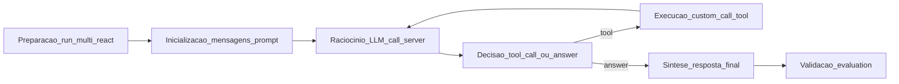
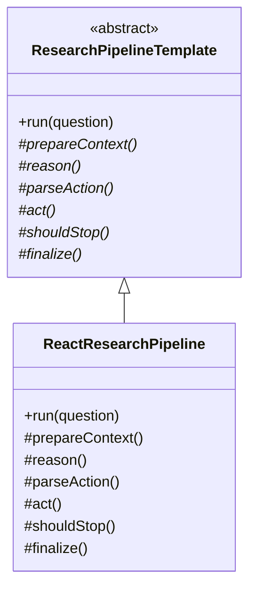
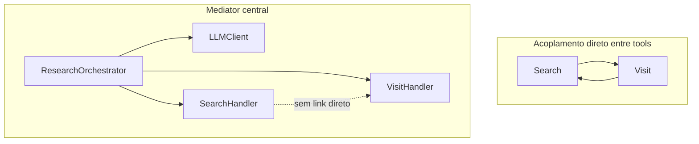
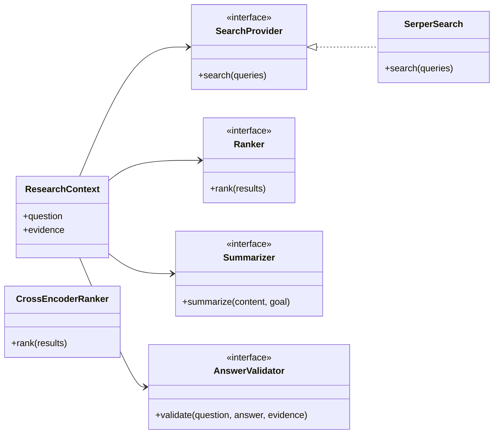
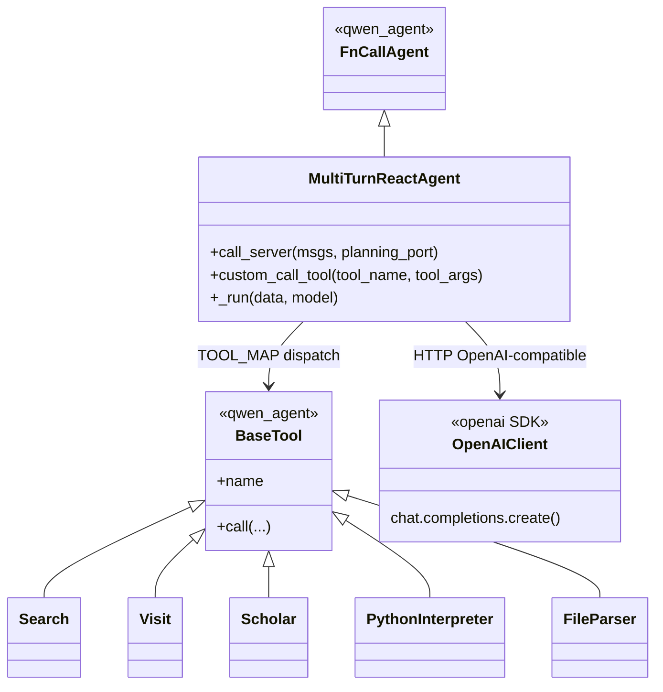
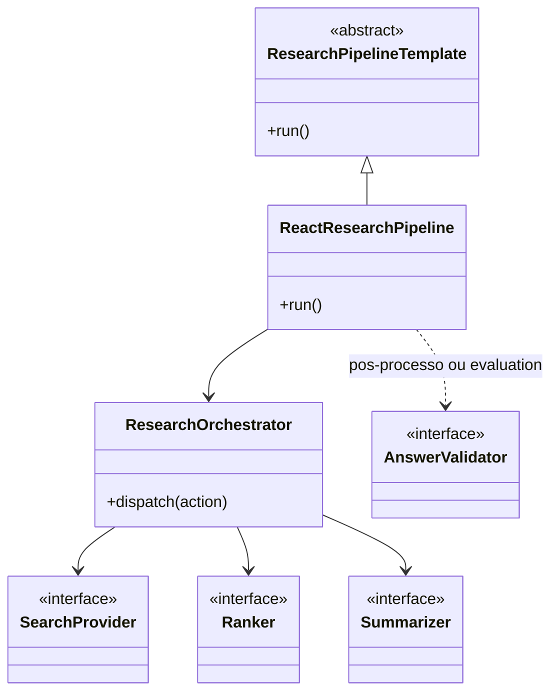

# DeepResearch — Padrões em OSS (atividades 1 a 4)

**Disciplina:** Engenharia de Software (COMP0503) — UFS  
**Atividade:** Padrões em OSS — análise do projeto [Alibaba-NLP/DeepResearch](https://github.com/Alibaba-NLP/DeepResearch) (Tongyi DeepResearch)  
**Data:** 20–21 de maio de 2026  
**Escopo da análise de código:** pasta `inference/` do clone local; menções a `WebAgent/` e `evaluation/` quando pertinentes.

> Este documento é **distinto** da Atividade Avaliativa 1 (auditoria CMMI/MPS.BR em `docs/`). Aqui respondemos apenas aos quatro enunciados da aula sobre **Template Method**, **Mediator** e **Strategy**.

---

## Identificação da equipe

| # | Nome | Matrícula |
|---|------|-----------|
| 01 | Alícia Vitória Sousa Santos | 202300027015 |
| 02 | Alisson Francisco dos Santos | 202300083248 |
| 03 | Brenno Phelipe Silva dos Santos | 202400050750 |
| 05 | Davi Emanuel de Menezes Costa | 202300027178 |
| 06 | Guilherme Rosário Alves | 202100022784 |
| 07 | Uilson Alves dos Santos Neto | 201900115954 |

---

## Contexto

O **DeepResearch** implementa um agente de pesquisa profunda no paradigma **ReAct** (Reason + Act): o modelo raciocina em linguagem natural, decide chamar ferramentas externas (busca, visita a páginas, scholar, Python, arquivos) e incorpora as observações até produzir uma resposta final. O núcleo analisado está em `inference/react_agent.py`, orquestrado por `inference/run_multi_react.py` e guiado por prompts em `inference/prompt.py`.

A visão do projeto — agentes, navegação, coleta de evidências e síntese — materializa-se como um **loop iterativo** estável, com **pontos de variação** (qual ferramenta, qual provedor de busca, parâmetros do modelo, critérios de parada). Os padrões GoF ajudam a nomear o que já existe de forma implícita e o que poderia ser explicitado para evolução e experimentação.

---

## Fluxo de referência (comum às quatro atividades)

O fluxo abaixo resume as etapas observadas no código e serve de referência para indicar **em qual fase cada padrão opera** (especialmente na Atividade 4).



| Etapa | Artefato principal | Papel |
|-------|-------------------|--------|
| Preparação | `run_multi_react.py` | Carrega dataset, instancia agente, workers paralelos, rollouts |
| Inicialização | `prompt.py` (`SYSTEM_PROMPT`), `react_agent.py` | Monta mensagens system + user com data atual |
| Raciocínio | `call_server` | HTTP OpenAI-compatible → vLLM local |
| Decisão | Parse de `<tool_call>` / `<answer>` no conteúdo do LLM | Escolhe continuar com ferramenta ou encerrar |
| Execução | `custom_call_tool` + `TOOL_MAP` | Dispara `Search`, `Visit`, etc. |
| Síntese | Tags `<answer>` ou política por limite de tokens | Resposta final ao usuário |
| Validação | `evaluation/evaluate_deepsearch_official.py` | Juiz LLM e benchmarks (fora do loop ReAct) |

---

## Atividade 1 — Fluxo principal e Template Method

### Investigação: sequência estável com pontos de variação

O processo de pesquisa no núcleo `inference/` **segue uma sequência estável** repetida a cada rodada do agente:

1. Montar contexto (system prompt + pergunta + histórico).
2. Invocar o modelo (`call_server`).
3. Interpretar a saída (tool call ou resposta final).
4. Se houver tool call, executar ferramenta e acrescentar observação como mensagem de usuário.
5. Repetir até `<answer>`, esgotar chamadas LLM, estourar tempo (~150 min) ou tokens (~110k).

Os **pontos de variação** observáveis são:

| Aspecto estável | Onde varia |
|-----------------|------------|
| Estrutura do loop `while` em `_run` | Nome e argumentos da ferramenta no JSON dentro de `<tool_call>` |
| Formato ReAct (`<tool_call>`, `<tool_response>`, `<answer>`) | Ramo especial para `PythonInterpreter` com bloco `<code>` |
| Políticas de parada (tempo, tokens, `MAX_LLM_CALL_PER_RUN`) | Valor de `termination` no resultado (ex.: `answer`, `exceed available llm calls`) |
| Entrada do pipeline | Hiperparâmetros CLI (`--temperature`, `--model`, splits de dataset) |

Evidência do esqueleto do loop e do dispatch de ferramentas:

```120:179:C:\Users\guilh\Documents\GithubCloud\ufs_engenharia_software\DeepResearch\inference\react_agent.py
    def _run(self, data: str, model: str, **kwargs) -> List[List[Message]]:
        ...
        while num_llm_calls_available > 0:
            ...
            content = self.call_server(messages, planning_port)
            ...
            if '<tool_call>' in content and '</tool_call>' in content:
                ...
                result = self.custom_call_tool(tool_name, tool_args)
                ...
                messages.append({"role": "user", "content": result})
            if '<answer>' in content and '</answer>' in content:
                termination = 'answer'
                break
```

Registro estável das ferramentas disponíveis:

```31:38:C:\Users\guilh\Documents\GithubCloud\ufs_engenharia_software\DeepResearch\inference\react_agent.py
TOOL_CLASS = [
    FileParser(),
    Scholar(),
    Visit(),
    Search(),
    PythonInterpreter(),
]
TOOL_MAP = {tool.name: tool for tool in TOOL_CLASS}
```

### Discussão: adequação do Template Method

O padrão **Template Method** define um algoritmo em uma operação de classe base, adiando alguns passos para subclasses. No DeepResearch há uma forma **parcial** desse padrão:

- **Classe base (framework):** `FnCallAgent` da biblioteca `qwen_agent` define o contrato de agente com chamada de funções; o código-fonte da base não está no clone, mas a herança é explícita: `class MultiTurnReactAgent(FnCallAgent)`.
- **Especialização:** `_run` implementa o template concreto do pipeline ReAct multi-turn — equivalente a preencher os passos do “algoritmo de pesquisa” do projeto.
- **Hooks implícitos:** `call_server` (inferência), `custom_call_tool` (ação), `count_tokens` (controle de contexto), `sanity_check_output` — funcionam como subetapas substituíveis sem estarem nomeadas como métodos abstratos.

**Por que o padrão é adequado para modelar este pipeline**

- O fluxo de pesquisa profunda é naturalmente um **roteiro fixo** (perguntar → agir → observar → repetir) com **variantes** nas implementações de cada passo (ferramenta, backend LLM, critério de parada).
- Explicitar um `ResearchPipelineTemplate` com métodos protegidos — por exemplo `prepareContext()`, `reason()`, `act()`, `observe()`, `shouldStop()` — separa **política de orquestração** de **detalhes de provedores**, facilitando testes unitários por fase e documentação UML alinhada à disciplina.

**Limitação atual**

O método `_run` concentra parsing XML/JSON, dispatch, tratamento de exceções genéricas e políticas de término em um único bloco (~100 linhas). Isso é um template **monolítico**: o padrão está presente por convenção de herança, mas não por desenho explícito de hooks.

### Modelo recomendável (Template Method explícito)



**Etapa do fluxo em que opera:** do **início do loop ReAct** até a **síntese** — ou seja, `init` → `think` → `decide` → `exec` (iterativo) → `synth` no diagrama de referência.

---

## Atividade 2 — Colaboração entre componentes e Mediator

### Avaliação da hipótese Mediator

No núcleo `inference/` **não existe** uma classe chamada `Mediator`, mas o comportamento de **coordenação centralizada** entre módulos especializados está presente:

- Várias **ferramentas** (`Search`, `Visit`, `Scholar`, `PythonInterpreter`, `FileParser`) implementam o contrato `BaseTool` do `qwen_agent`.
- O agente **`MultiTurnReactAgent`** é o único ponto que conhece todas as instâncias via `TOOL_MAP` e as invoca por `custom_call_tool`.
- As tools **não se referenciam entre si**; toda interação passa pelo histórico de mensagens controlado pelo agente (padrão ReAct).

Isso aproxima o desenho de um **Mediator** (ou **Facade** de orquestração): componentes colaboram **indiretamente**, mediados pelo agente, em vez de formar uma rede de dependências tool-to-tool.

```228:247:C:\Users\guilh\Documents\GithubCloud\ufs_engenharia_software\DeepResearch\inference\react_agent.py
    def custom_call_tool(self, tool_name: str, tool_args: dict, **kwargs):
        if tool_name in TOOL_MAP:
            ...
            raw_result = TOOL_MAP[tool_name].call(tool_args, **kwargs)
            return result
        else:
            return f"Error: Tool {tool_name} not found"
```

### Múltiplos agentes no monorepo

A pasta **`WebAgent/`** agrupa subprojetos (`WebWeaver`, `WebSailor`, `WebWalker`, `WebResearcher`, etc.), cada um com cópias ou variantes de `react_agent.py` e scripts de execução. A coordenação entre esses subprojetos é **fraca**: organização por diretório, sem um mediador único no repositório.

O README do **WebResearcher** descreve um pipeline multi-agente para síntese de dados (`ItemWriter`, `QuestionSolver`, `Judge`), o que **sugere** Mediator em nível de processo de treinamento/dados, mas isso **não está unificado** no núcleo `inference/` analisado aqui.

### Quando um orquestrador central melhora a coordenação

Um **orquestrador central** (mediador) é benéfico neste domínio quando:

1. **Várias capacidades especializadas + um único “cérebro” LLM:** o modelo decide qual tool usar; o mediador evita que `Search` invoque `Visit` diretamente, mantendo um único protocolo de mensagens e reduzindo dependências caóticas entre módulos.
2. **Políticas globais:** limites de tokens, tempo máximo, número de chamadas LLM e formato de observação (`<tool_response>`) são regras do mediador, não de cada ferramenta — garante consistência do episódio de pesquisa.
3. **Evolução do catálogo de tools:** registrar handlers em um mapa (como `TOOL_MAP`) permite adicionar ferramentas sem alterar o contrato das existentes.

**Risco observado (mediador “gordo”)**

O mesmo agente concentra parsing frágil de `<tool_call>`, ramos especiais para Python, retry de LLM e dispatch com `if/elif`. Um mediador **fino** delegaria parsing e execução a colaboradores registrados, mantendo só roteamento e políticas transversais.

### Anti-padrão vs. modelo recomendável



**Etapa do fluxo em que opera:** principalmente **decisão** e **execução** (`decide` + `exec`) — o agente interpreta a ação e roteia para a ferramenta correta.

---

## Atividade 3 — Estratégias intercambiáveis (Strategy)

### O que já existe no OSS (Strategy parcial)

O projeto já aplica uma forma de **Strategy** na camada de ferramentas:

- Interface comum: `BaseTool` (framework `qwen_agent`).
- Implementações concretas registradas em `TOOL_CLASS` / `TOOL_MAP`.
- **Seleção em tempo de execução** pelo nome retornado no `<tool_call>` JSON.

Assim, trocar *qual* ferramenta usar é flexível; trocar *como* cada capacidade é implementada internamente é limitado.

### Onde o acoplamento impede experimentação

| Capacidade | Implementação observável | Impacto |
|------------|-------------------------|---------|
| Busca web | `Search.google_search_with_serp` fixo em API Serper | Difícil comparar Bing, Tavily ou busca interna sem editar a classe |
| Inferência | `call_server` com `OpenAI` apontando para `127.0.0.1:{port}/v1` | Provedor alternativo (ex.: OpenRouter) só via comentários no código |
| Sumarização de páginas | Lógica e prompts embutidos em `tool_visit.py` / prompts | Não há interface `Summarizer` plugável |
| Validação de resposta | `evaluation/evaluate_deepsearch_official.py` — juiz LLM com JSON schema | Boa estratégia de validação **extrínseca**, desacoplada do loop do agente |

Exemplo de acoplamento à API Serper:

```15:19:C:\Users\guilh\Documents\GithubCloud\ufs_engenharia_software\DeepResearch\inference\tool_search.py
SERPER_KEY=os.environ.get('SERPER_KEY_ID')

@register_tool("search", allow_overwrite=True)
class Search(BaseTool):
```

O `.env.example` do projeto lista várias chaves de terceiros (Serper, Jina, Dashscope, sandbox, etc.), o que **indica** que a equipe de desenvolvimento prevê múltiplos provedores — um desenho Strategy explícito alinharia código e configuração.

### Proposta: interfaces Strategy recomendáveis

| Interface Strategy | Variantes possíveis | Benefício para experimentação |
|-------------------|-------------------|--------------------------------|
| `SearchProvider` | Serper, Bing, API corporativa | A/B de recall e custo sem mudar o agente ReAct |
| `Ranker` | heurística posicional, cross-encoder, rerank por LLM | Melhorar qualidade das evidências antes da síntese |
| `Summarizer` | prompt único, modelo menor, map-reduce por URL | Ajustar latência/custo da etapa de visita |
| `AnswerValidator` | regras de formato, juiz LLM, exigência de citações | Mitigar alucinação; trocar modelo juiz em benchmarks |



### Justificativa: modelos e provedores distintos

Em ecossistemas LLM, times de pesquisa e produto precisam **alternar modelos** (local vLLM, APIs comerciais, juízes menores) e **provedores de dados** (busca, leitura de página, scholar) sem reescrever o loop ReAct. O padrão Strategy:

- Isola algoritmos que variam por **política experimental**.
- Permite injeção via configuração (`config.yaml` / variáveis de ambiente) em vez de `if provider == "serper"` espalhado.
- Facilita **telemetria comparável** (mesmo pipeline, métricas diferentes por estratégia).

**Etapas do fluxo em que opera:** principalmente **execução** (`exec` — tools) e **validação** (`val` — `evaluation/`).

---

## Atividade 4 — Entrega comparativa

### Tabela: padrão observável vs. recomendável

| Padrão | Já observável no DeepResearch | Recomendável | Etapa do fluxo |
|--------|------------------------------|--------------|----------------|
| **Template Method** | `FnCallAgent` (qwen_agent) + override de `_run`; loop ReAct monolítico com hooks implícitos (`call_server`, `custom_call_tool`) | Classe abstrata `ResearchPipelineTemplate` com passos nomeados (`prepareContext`, `reason`, `act`, `shouldStop`, `finalize`) | `init` → loop `think`/`decide`/`exec` → `synth` |
| **Mediator** | `MultiTurnReactAgent` + `TOOL_MAP` / `custom_call_tool`; tools não se comunicam entre si; `WebAgent/` sem mediador global | `ResearchOrchestrator` fino + registro de handlers; separar parsing de tool call do roteamento | `decide` + `exec` |
| **Strategy** | `BaseTool` + dispatch por `tool.name`; Serper/OpenAI acoplados nas implementações; validação por juiz LLM só em `evaluation/` | `SearchProvider`, `Ranker`, `Summarizer`, `AnswerValidator` injetáveis por configuração | `exec` (ferramentas) + `val` (benchmarks) |

### Síntese

O DeepResearch **materializa** boa parte da intenção dos três padrões de forma **implícita**, via framework (`qwen_agent`) e convenções ReAct, mas **não os nomeia nem os isola** como extensões estáveis. Para um pipeline de pesquisa profunda — sequência longa, múltiplos provedores, necessidade de benchmarks — a combinação recomendada seria:

- **Template Method** para o esqueleto do episódio de pesquisa;
- **Mediator** para coordenação LLM ↔ tools sem acoplamento mútuo;
- **Strategy** para cada mecanismo que muda em experimentos (busca, ranking, resumo, validação).

Essa explicitação não exige reescrever o produto de imediato; serve como **modelo alvo** para evolução arquitetural e para documentação UML da disciplina.

### Diagrama UML — visão observável (estado atual)



### Diagrama UML — visão recomendável (alvo de desenho)



### Exportação de diagramas

Para PDF ou apresentação em sala: copiar cada bloco `mermaid` deste arquivo para o [Mermaid Live Editor](https://mermaid.live) e exportar PNG ou SVG.

---

## Referências

- Repositório analisado: [https://github.com/Alibaba-NLP/DeepResearch](https://github.com/Alibaba-NLP/DeepResearch)
- Auditoria A1 da mesma equipe (contexto separado): [docs/arquitetura-pjr.md](../docs/arquitetura-pjr.md)
- Uso de IA na elaboração: [docs/uso-de-ia.md](../docs/uso-de-ia.md)

---

*Documento redigido com apoio do Cursor IDE (assistente Claude) e sujeito à revisão da Equipe 1.*
