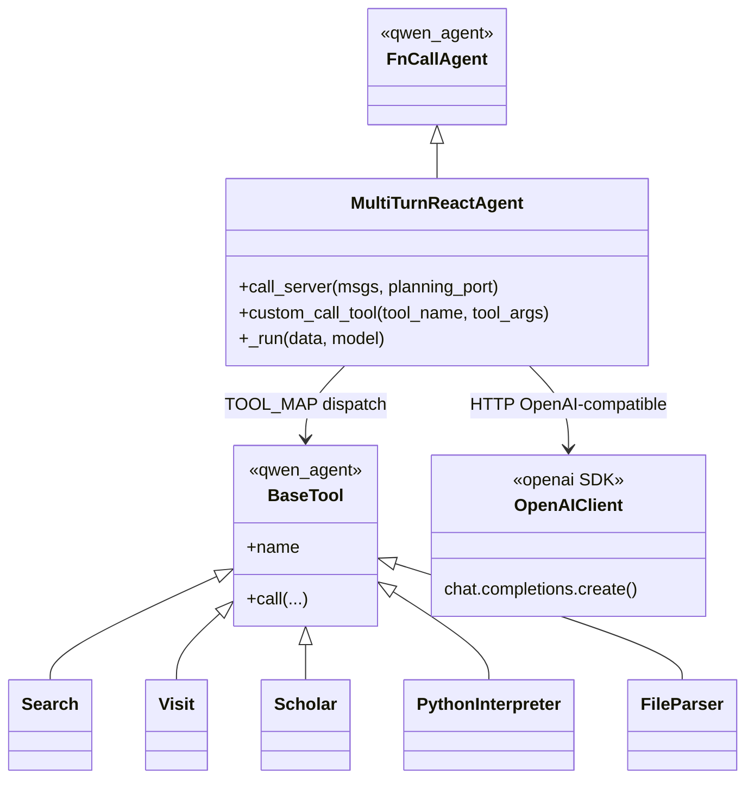

# Arquitetura e modelagem (PJR)

**Projeto analisado:** [Alibaba-NLP/DeepResearch](https://github.com/Alibaba-NLP/DeepResearch)  
**Escopo principal desta auditoria:** pasta `inference/` (agente ReAct) e ferramentas associadas.

## 1. Fluxo principal da aplicação

1. **Preparação:** variáveis em `.env` (raiz), modelo servido via vLLM (script `inference/run_react_infer.sh`).
2. **Orquestração:** `run_multi_react.py` carrega dataset JSON/JSONL, instancia `MultiTurnReactAgent` e dispara workers.
3. **Loop ReAct:** em `MultiTurnReactAgent._run` (`inference/react_agent.py`):
   - Monta mensagens com `SYSTEM_PROMPT` (`inference/prompt.py`) + pergunta do usuário.
   - Chama o modelo via `call_server` (cliente OpenAI-compatible apontando para `http://127.0.0.1:{port}/v1`).
   - Interpreta `<tool_call>` / `<tool_response>` e encaminha para `custom_call_tool`.
   - Encerra com `<answer>...</answer>` ou por limites (tempo, tokens, chamadas LLM).

## 2. Separação de responsabilidades

| Camada | Artefatos | Papel |
|--------|-----------|--------|
| **Entrada / CLI** | `run_multi_react.py`, `run_react_infer.sh` | Argumentos, dataset, portas, processamento paralelo. |
| **Orquestração / domínio do agente** | `MultiTurnReactAgent`, `FnCallAgent` (biblioteca `qwen_agent`) | Ciclo multi-turn, política de parada, limite de tokens. |
| **Integração LLM** | `call_server`, `OpenAI` SDK | Transporte HTTP para API compatível com OpenAI (vLLM local ou, por configuração comentada, OpenRouter). |
| **Ferramentas (tools)** | `tool_search.py`, `tool_visit.py`, `tool_scholar.py`, `tool_python.py`, `tool_file.py` | Efeitos colaterais: HTTP externo, sandbox Python, parsing de arquivos. |
| **Infraestrutura externa** | Serper, Jina, Dashscope, SandboxFusion (via `.env.example`) | Serviços de terceiros; não fazem parte do núcleo do agente. |

## 3. Padrões arquiteturais identificados

- **Strategy:** cada ferramenta (`Search`, `Visit`, `Scholar`, `PythonInterpreter`, `FileParser`) implementa o contrato `BaseTool` do `qwen_agent`; o agente escolhe a estratégia pelo nome retornado no `<tool_call>`.
- **Adapter:** cliente `OpenAI` padroniza o acesso ao backend de inferência (servidor estilo OpenAI), isolando detalhes de transporte.
- **Facade:** `MultiTurnReactAgent` / `custom_call_tool` concentram a invocação das tools atrás de `TOOL_MAP`.
- **Pipeline / loop:** o fluxo ReAct é um pipeline iterativo (LLM → tool → observação → LLM) até resposta final.
- **Template Method:** `FnCallAgent` (framework) define o esqueleto; `MultiTurnReactAgent` especializa `_run` e `call_server`.

## 4. Componentes para diagrama de classes UML

### Lista de componentes (classes / módulos centrais)

- `MultiTurnReactAgent` — agente ReAct multi-turn.
- `FnCallAgent` — classe base (externa: `qwen_agent`).
- `BaseTool` — contrato de ferramentas (externa).
- `Search`, `Visit`, `Scholar`, `PythonInterpreter`, `FileParser` — ferramentas concretas.
- `TOOL_MAP` — registro nome → instância.
- `OpenAI` (SDK) — cliente de inferência.

### Relações (UML)

- `MultiTurnReactAgent` **—herda→** `FnCallAgent`
- `MultiTurnReactAgent` **—usa→** `OpenAI` (composição em `call_server`)
- `MultiTurnReactAgent` **—usa→** `TOOL_MAP` / `BaseTool`
- `Search`, `Visit`, … **—herda→** `BaseTool`

### Interfaces que desacoplam negócio e API de LLM

- O **contrato de inferência** é o protocolo HTTP **OpenAI-compatible** (`/v1/chat/completions`), não chamadas diretas ao peso do modelo dentro do laço de negócio (o modelo roda em processo separado vLLM).
- As **ferramentas** estão registradas como `BaseTool`, separando decisão do modelo (texto/XML) da execução (HTTP, sandbox, parser).

## 5. Diagrama UML (Mermaid)

## 6. Relação CMMI / MPS.BR (PJR / Solução técnica)

- **CMMI-DEV (Technical Solution):** solução decomposta em subsistemas (agente, servidor de modelo, ferramentas) com interfaces explícitas (API OpenAI, `BaseTool`).
- **MR-MPS-SW — Projeto e Construção:** o desenho combina componente reutilizável (`qwen_agent`) com extensões específicas (`tool_*.py`, `prompt.py`).

## 7. Limitações da análise

- O subprojeto **WebAgent** contém múltiplos agentes e cópias de `qwen_agent`; este documento foca no núcleo `inference/` para o diagrama principal da disciplina. Uma auditoria completa poderia detalhar um segundo diagrama para `WebAgent/WebWatcher/`.
