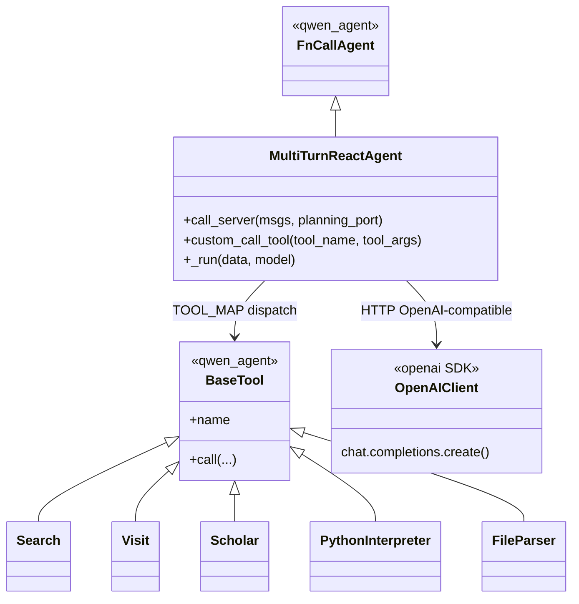

# Atividade Avaliativa 1 — Auditoria de Maturidade em Ecossistemas LLM

**Disciplina:** Engenharia de Software (COMPO503)  

**Instituição:** UFS 

**Turma / semestre:** T02 - 2026.1

 **Data de elaboração deste documento:** 23/04/2026

---

## Identificação da equipe (Equipe 1)

**Projeto analisado:** **DeepResearch** (Tongyi DeepResearch)  
**Repositório oficial:** https://github.com/Alibaba-NLP/DeepResearch  

**Repositório de trabalho da equipe (artefatos da auditoria):** repositório `ES_2026-2_DeepResearch` https://github.com/athena272/ES_2026-2_DeepResearch.

| # | Nome | Matrícula | Contribuição individual nesta auditoria |
|---|------|-----------|----------------------------------------|
| 01 | Alícia Vitória Sousa Santos | 202300027015 | Eixo **GPR**: leitura dos READMEs (raiz e `WebAgent/`), notas sobre roadmap comunicado, ritmo via histórico Git (`git log` / ausência de tags), Releases no GitHub e riscos de APIs; redação da seção 3 e revisão cruzada com o material em `docs/gestao-projeto-gpr.md`. |
| 02 | Alisson Francisco dos Santos | 202300083248 | Eixo **GRE**: mapeamento do fluxo Issues/PRs (ausência de RFC formal), definição dos requisitos inferidos R1–R3 e montagem das trilhas de rastreabilidade (**#233**, **#14**, **#181**); conferência no GitHub e apoio na descrição das figuras do relatório; base em `docs/requisitos-rastreabilidade-gre.md`. |
| 03 | Brenno Phelipe Silva dos Santos | 202400050750 | Eixo **PJR**: análise do fluxo ReAct em `inference/react_agent.py`, `prompt.py` e `tool_*.py`, camadas (orquestração / LLM / tools), padrões arquiteturais e texto da seção 5; apoio na exportação do diagrama de classes (Mermaid → imagem para o PDF); base em `docs/arquitetura-pjr.md`. |
| 04 | Breno Copeland Pitanga | 202100011225 | **Abertura e replicação:** redação das seções **1** (introdução, escopo, metodologia, limitações) e **2** (contexto do projeto); organização do roteiro de **referências** e alinhamento com `docs/replicacao.md` para permitir que terceiros reproduzam a auditoria; apoio na checagem da tabela de **anexos/figuras**. |
| 05 | Davi Emanuel de Menezes Costa | 202300027178 | Eixo **V&V**: distinção verificação × validação, levantamento de testes/CI (`evaluation/`, ausência de `pytest` evidente, Actions no remoto), papel do juiz LLM em `evaluate_deepsearch_official.py` e peer review em PRs; redação da seção 6; base em `docs/verificacao-validacao.md`. |
| 06 | Guilherme Rosário Alves | 202100022784 | **Coordenação** da auditoria: padronização do repositório da equipe (`ES_2026-2_DeepResearch`), consolidação deste `relatorio-base.md`, integração dos trechos dos `docs/`, alinhamento CMMI/MPS.BR entre seções, capturas de tela no GitHub (PR **#233**, issues **#14** e **#181**) e revisão final de linguagem e consistência antes do PDF. |
| 07 | Uilson Alves dos Santos Neto | 201900115954 | Eixo **GQA**, **plano de melhoria** e **conclusão**: auditoria de `CONTRIBUTING.md`, lint/análise estática, dívida técnica (TODOs, exceções), tabela de aderência; elaboração das duas ações prioritárias (MPS.BR G) e texto das seções **8** e **9**; base em `docs/qualidade-gqa.md` e `docs/plano-melhoria.md`. |

*Divisão de papel por eixo da atividade (Equipe 1 com sete integrantes); revisão conjunta do documento e do repositório antes da entrega.*

**Vídeo da auditoria:** *(inserir link do YouTube ou Google Drive — também no README do repositório da equipe, conforme enunciado).*

---

## 1. Introdução

### 1.1 Objetivo

Este documento apresenta uma **auditoria técnica de maturidade de processo** aplicada ao projeto open source **DeepResearch**, relacionando práticas observadas no **GitHub** e no **código** a referenciais de **CMMI-DEV (v2.0)** e **MR-MPS-SW (MPS.BR)**, no contexto de aplicações baseadas em **modelos de linguagem (LLM)**.

### 1.2 Escopo (cinco eixos)

| Eixo | Foco | Referência de processo (visão geral) |
|------|------|----------------------------------------|
| **GPR** | Ciclo de vida e metodologias ágeis | Planejamento e monitoramento; gerência de projetos |
| **GRE** | Engenharia de requisitos | REQM; gerência de requisitos |
| **PJR** | Arquitetura e modelagem | Solução técnica; projeto e construção |
| **V&V** | Verificação e validação | VER/VAL; verificação e validação |
| **GQA** | Qualidade de software | PPQA; garantia da qualidade |

### 1.3 Metodologia

1. **Inspeção do clone local** do repositório oficial (`inference/`, `evaluation/`, `WebAgent/`, documentação, ausência de `.github/workflows` e de `CONTRIBUTING.md` na árvore analisada).  
2. **Consulta ao GitHub remoto** para evidências que não existem no clone: **Issues**, **Pull Requests**, **Actions**, **Releases**, revisões em PRs.  
3. **Correlação** entre achados e práticas de maturidade (texto normativo da disciplina / material de apoio).  

### 1.4 Limitações

- **Issues, Milestones, Projects** e políticas de branch não são inferíveis apenas pelo filesystem; dependem do **GitHub**.  
- A página de **Releases** foi verificada em momento anterior à entrega; o estado pode mudar — recomenda-se **reconsultar** antes da defesa.  
- O repositório é **pesquisa + código**; não se espera o mesmo nível de processo de um produto comercial fechado.

---

## 2. Contexto do projeto DeepResearch

O **DeepResearch** divulga o agente **Tongyi DeepResearch**, voltado a tarefas de **busca e síntese de informação** em horizonte longo, com desempenho reportado em benchmarks acadêmicos e de agentes. O repositório combina:

- **Núcleo de inferência ReAct** em `inference/` (`react_agent.py`, `prompt.py`, `tool_*.py`, scripts shell).  
- **Avaliação** em `evaluation/` (scripts que usam juiz LLM e gabaritos).  
- **Ecossistema WebAgent** em `WebAgent/` (vários subprojetos de agentes web e dados de benchmark).

**Stack relevante (visão de alto nível):** Python; integração com **API compatível com OpenAI** para o servidor de modelo (ex.: **vLLM** local); biblioteca **qwen_agent** (`FnCallAgent`, `BaseTool`); dependências externas documentadas em **`.env.example`** (Serper, Jina, Dashscope, sandbox de código, etc.).

---

## 3. GPR — Ciclo de vida e metodologias ágeis

### 3.1 Roadmap e comunicação

O **README** principal e o **README** de `WebAgent/` comunicam evolução do produto (notícias, links para modelos, linha do tempo de publicações). Há **figuras de roadmap** no material do WebAgent. Isso caracteriza **planejamento comunicado ao público**, mas **não substitui** artefatos internos de planejamento (ex.: quadros GitHub Projects), se existirem.

### 3.2 Ritmo de entrega e versionamento

No clone utilizado na auditoria, **`git tag -l`** não listou tags de versão. No **GitHub**, a página de **Releases** **não apresentava releases formais** no momento consultado — o que enfraquece a ligação explícita “pacote versionado ↔ conjunto de commits”. Ainda assim, o **histórico de commits** e **merges de PRs** (ex.: `#226`, `#208`) indicam **ritmo contínuo** de integração na branch principal.

### 3.3 Gestão de risco técnico (volatilidade de APIs e serviços)

- **`.env.example`** concentra chaves e endpoints de **terceiros** (busca, leitura de página, parsing, sandbox). Mudanças nessas APIs afetam diretamente o comportamento do agente.  
- Em **`react_agent.py`**, a função **`call_server`** implementa **retentativas com backoff** para erros de rede/API e timeout elevado, mitigando falhas **transientes**.  
- O README alerta que **demos online** podem falhar por latência e limites de QPS — reconhecimento de risco para o usuário.

### 3.4 Relação com CMMI / MPS.BR (GPR)

Há **monitoramento implícito** via fluxo de issues/PRs no GitHub, mas **faltam evidências** no repositório de **estimativas formais**, **cronogramo baseline** ou **gestão de risco documentada** como processo. O perfil é de **projeto open source de pesquisa** com comunicação forte por documentação, próximo ao que se discute em **gerência de projetos** em nível inicial, porém **sem** amarração a releases nomeadas.

---

## 4. GRE — Engenharia de requisitos e rastreabilidade

### 4.1 Processo de mudança (RFC)

**Não** foi encontrado, na raiz do repositório analisado, processo nomeado tipo **RFC** (pasta ou política explícita). A mudança parece seguir o fluxo **Issues + Pull Requests** do GitHub.

### 4.2 Requisitos inferidos (alto nível)

| ID | Requisito inferido | Evidência documental | Evidência no código |
|----|---------------------|----------------------|---------------------|
| **R1** | Aceitar datasets em **JSON** ou **JSONL** com `question` e `answer`. | README (“Prepare Evaluation Data”) | `run_multi_react.py` |
| **R2** | Suportar **ferramentas** (busca, visita, scholar, Python, arquivos) no loop ReAct. | README, `prompt.py` (`<tools>`) | `react_agent.py` — `TOOL_CLASS`, `custom_call_tool` |
| **R3** | Obter respostas do modelo via **API OpenAI-compatible** (vLLM local; OpenRouter comentado no código/README). | README, comentários em `react_agent.py` | `call_server` + cliente OpenAI |

### 4.3 Trilhas de rastreabilidade (amostra verificada no GitHub)

O GitHub usa **numeração unificada** para issues e pull requests. Abaixo, as trilhas foram **conferidas em capturas de tela** pelo grupo *(data a anotar no PDF, se desejado)*.

#### Trilha A — correção com revisão antes do merge (**#233**)

| Etapa | Artefato | Detalhe |
|-------|-----------|---------|
| Mudança proposta / integrada | [Pull Request #233](https://github.com/Alibaba-NLP/DeepResearch/pull/233) | Título alinhado a correção de bug (`parse_retry_times`, tipagem `Any`); **revisor** (`callanwu`) com **aprovação**; merge na `main` em **08/01/2026**; **2 commits**, **2 arquivos** alterados. |
| Código | Commits `c05398f`, `f4b6a05` | `inference/tool_visit.py`, `inference/tool_python.py` |

*Observação:* na interface do GitHub, a seção “Development” pode indicar **nenhuma issue vinculada** automaticamente; a rastreabilidade forte aqui é **PR → commits → arquivos**, típica de contribuições externas bem conduzidas.

---

---

#### Trilha B — defeito funcional (**#14**)

| Etapa | Artefato | Detalhe |
|-------|-----------|---------|
| Relato | [Issue #14](https://github.com/Alibaba-NLP/DeepResearch/issues/14) | Agente do WebWalker preso a URL de exemplo; discussão encerrada com referência a **commit** que remove URL fixa (`ROOT`). |
| Código | `569126e` (e menção a `72fa820` na timeline) | `WebAgent/WebWalker/src/app.py` |

---

---

#### Trilha C — dados de benchmark (**#181**)

| Etapa | Artefato | Detalhe |
|-------|-----------|---------|
| Relato | [Issue #181](https://github.com/Alibaba-NLP/DeepResearch/issues/181) | Solicitação sobre arquivos de imagem do benchmark; encerrada como concluída. |
| Código / dados | Commit `eb0c36d` (verificado) | Atualização dos arquivos `WebAgent/WebWatcher/benchmark/bc_vl_level1.jsonl` e `bc_vl_level2.jsonl` |

---

---

### 4.4 Relação com CMMI / MPS.BR (GRE)

As trilhas exemplificam **ligação** entre relato público (issue/PR) e alteração em código ou dados — núcleo da **rastreabilidade** em **REQM / Gerência de requisitos**. A maturidade seria maior com **templates de issue**, **critérios de aceite explícitos** e **vínculo automático** (ex.: “Closes #n”) de forma consistente em todos os PRs.

---

## 5. PJR — Arquitetura e modelagem

### 5.1 Fluxo principal

1. Configuração via **`.env`** e subida do modelo (**vLLM**, script `inference/run_react_infer.sh`).  
2. **`run_multi_react.py`** carrega o dataset e instancia o agente.  
3. **`MultiTurnReactAgent._run`** (`inference/react_agent.py`) executa o **loop ReAct**: mensagens com **`SYSTEM_PROMPT`** (`inference/prompt.py`) → chamada ao modelo em **`call_server`** → interpretação de **`<tool_call>`** / **`<tool_response>`** → **`custom_call_tool`** → até **`<answer>`** ou limites (tempo, tokens, número de chamadas).

### 5.2 Separação de responsabilidades (camadas)

| Camada | Artefatos principais |
|--------|----------------------|
| Entrada / CLI | `run_multi_react.py`, `run_react_infer.sh` |
| Orquestração | `MultiTurnReactAgent`, `FnCallAgent` (*qwen_agent*) |
| Integração LLM | Cliente **OpenAI SDK**, endpoint `http://127.0.0.1:{port}/v1` |
| Ferramentas | `tool_search.py`, `tool_visit.py`, `tool_scholar.py`, `tool_python.py`, `tool_file.py` |
| Infraestrutura externa | APIs configuradas em `.env.example` |

### 5.3 Padrões arquiteturais identificados

- **Strategy:** ferramentas plugáveis via `BaseTool` / `TOOL_MAP`.  
- **Adapter:** API OpenAI-compatible abstrai o backend de inferência.  
- **Facade:** `custom_call_tool` centraliza o despacho.  
- **Pipeline / loop:** ciclo ReAct iterativo.  
- **Template Method:** `FnCallAgent` define esqueleto; subclasse especializa comportamento.

### 5.4 Diagrama de classes (UML)

O diagrama em **Mermaid** está reproduzido abaixo para facilitar a exportação para o PDF *(recomenda-se renderizar em ferramenta externa para obter PNG/SVG de alta qualidade)*.

---

---

### 5.5 Relação com CMMI / MPS.BR (PJR)

O desenho atende bem a ideia de **Solução técnica** modular: **interfaces** (`BaseTool`, protocolo HTTP do modelo) **isolam** a orquestração de detalhes de infraestrutura e de provedores externos.

### 5.6 Limitação de escopo

Este relatório **prioriza** `inference/` no diagrama. O monorepo **`WebAgent/`** poderia gerar **diagrama complementar** em trabalho futuro.

---

## 6. V&V — Verificação e validação

### 6.1 Distinção adotada

| Tipo | Significado aqui | Evidência |
|------|------------------|-----------|
| **Verificação** | O software e o pipeline técnico se comportam como esperado (build, execução, formato, robustez a falhas). | Retries em `call_server`; políticas de parada no loop; scripts de inferência. |
| **Validação** | A **saída da IA** atende critério externo (benchmark, gabarito, juiz). | `evaluation/evaluate_deepsearch_official.py` — **juiz LLM** e métricas. |

### 6.2 Verificação automatizada

- **Não** foram encontrados `test_*.py` nem `pytest` na raiz do `requirements.txt` da forma auditada — **sem suíte de testes unitários evidente** para o núcleo `inference/`.  
- **Não** há pasta `.github/workflows` no clone analisado; no **GitHub Actions**, as execuções observadas foram de **“pages build and deployment”**, não de **teste/lint** de Python.  
- Conclusão: a **verificação contínua clássica (CI de qualidade de código)** **não está demonstrada**; a verificação depende de **execução manual** e de **scripts pesados** de avaliação.

---

---

### 6.3 Validação da saída da IA e “alucinação”

**Não há** módulo dedicado a detecção de alucinação. Há **mitigação indireta** por **ferramentas** (busca/visita) e **validação por benchmark** com **modelo juiz** — válida para pesquisa, porém **dependente** do juiz e do dataset.

### 6.4 Peer review

Exemplo documentado: **PR #233** com **aprovação** registrada antes do merge *(evidência em captura de tela)*. Não se infere, só pelo repositório, se **todas** as mudanças exigem revisão obrigatória (**branch protection**).

> **Nota:** no PDF, a **Figura 1** ou **Figura 2** já servem como evidência visual de **peer review** para o parágrafo acima (não é obrigatório repetir a mesma imagem aqui).

### 6.5 Relação com CMMI / MPS.BR (V&V)

- **VER:** fraco por ausência de CI de testes.  
- **VAL:** presente de forma **indireta** via benchmarks e juiz.

---

## 7. GQA — Qualidade de software

### 7.1 Contribuição e padrões

- **Ausência** de **`CONTRIBUTING.md`** na raiz analisada — dificulta padronizar contribuições e critérios de aceite.  
- **Não** foram encontradas configurações explícitas de **CodeQL**, **SonarQube**, **ruff**, **mypy** na raiz.

### 7.2 Pontos fortes

- **`.env.example`** e **`.gitignore`** bem alinhados a **segredos** e artefatos locais.  
- **Documentação** extensa (README, FAQ, relatório técnico em PDF no repositório oficial).  
- **Retries** em chamadas críticas (LLM e busca).

### 7.3 Fragilidades e dívida técnica

- Comentários **`TODO`** espalhados em subpastas de `WebAgent/`.  
- **`except:`** genéricos em trechos do agente — dificulta diagnóstico e testes.  
- **Acoplamento** a múltiplos serviços externos.  
- **Monorepo amplo** — possível duplicação e custo de manutenção.

### 7.4 Relação com CMMI / MPS.BR (GQA)

**PPQA / GQA** ficam **principalmente informais** (documentação + revisões pontuais em PRs), sem **gate** automatizado de qualidade no fluxo de integração.

---

## 8. Plano de melhoria de processo (duas ações prioritárias)

**Cenário:** aproximar o projeto de práticas compatíveis com **maturidade inicial** (ex.: **MPS.BR nível G**), sem confundir com certificação formal.

### Ação 1 — `CONTRIBUTING.md` e templates

**Problema:** falta guia único de contribuição. **Risco:** variabilidade e baixa rastreabilidade. **Ação:** publicar `CONTRIBUTING.md` com fluxo de issue/PR e checklist mínimo; opcionalmente templates em `.github/`. **Impacto:** melhora **REQM** e **PPQA** (critérios objetivos).

### Ação 2 — CI mínimo (fumaça + lint opcional)

**Problema:** ausência de testes automatizados evidentes e de workflows de qualidade. **Risco:** regressões silenciosas. **Ação:** GitHub Actions instalando dependências, rodando **lint** opcional e **testes de fumaça** (imports, parsing de JSONL com fixture pequena). **Impacto:** fortalece **VER** e **GQA** com evidência repetível.

*Nenhuma ação “garante” certificação; ambas endereçam **lacunas observadas** nesta auditoria.*

---

## 9. Conclusão

O **DeepResearch** apresenta **arquitetura de agente** clara (`inference/`), **validação orientada a benchmark** (`evaluation/`) e **comunicação** forte de roadmap. Em contraste, **faltam** artefatos típicos de **maturidade de processo** em código aberto acadêmico: **CONTRIBUTING**, **CI de testes**, **releases nomeadas** e **RFC** formal. As **trilhas no GitHub** (#233, #14, #181) demonstram que **rastreabilidade e revisão** existem em **casos concretos**, embora não de forma uniforme em todo o histórico.

**Trabalhos futuros:** segundo diagrama para `WebAgent/`; amostragem maior de PRs para caracterizar **revisão obrigatória**; acompanhar eventual criação de **Releases** ou **tags**.

---

## Referências

- Repositório analisado: https://github.com/Alibaba-NLP/DeepResearch  
- Material complementar da equipe (repositório `ES_2026-2_DeepResearch`): pasta `docs/` com versões detalhadas por eixo (`gestao-projeto-gpr.md`, `requisitos-rastreabilidade-gre.md`, `arquitetura-pjr.md`, `verificacao-validacao.md`, `qualidade-gqa.md`, `plano-melhoria.md`).  
- CMMI-DEV v2.0 e MR-MPS-SW: conforme **bibliografia e slides** da disciplina COMPO503.

---
