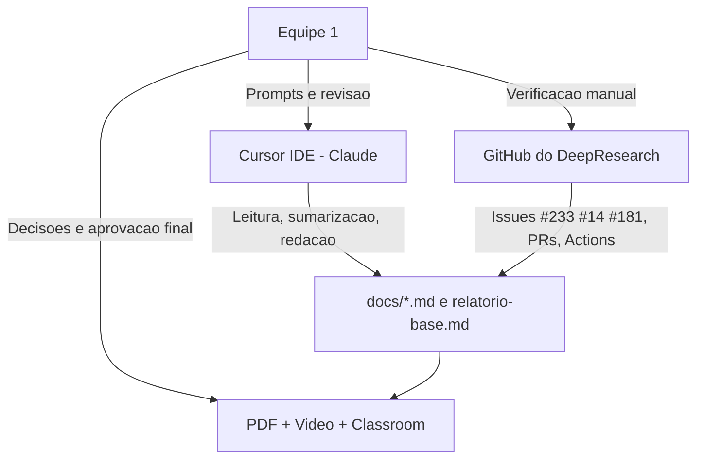

# Uso de inteligência artificial na elaboração desta auditoria

## 1. Contexto e justificativa

A **Atividade Avaliativa 1 (A1)** da disciplina **Engenharia de Software (COMPO503)** — UFS permite o uso de ferramentas de inteligência artificial, desde que o método seja **transparente** e o conteúdo entregue permaneça sob **responsabilidade da equipe**. Este documento descreve **como**, **com qual ferramenta** e **em que papel** a IA foi utilizada na auditoria do projeto **DeepResearch**, além do que foi feito **exclusivamente por humanos**.

## 2. Ferramenta utilizada

- **Cursor IDE** (editor com assistente integrado), em **modo agente**, com capacidade de ler e editar arquivos no workspace.
- O fluxo de trabalho incluiu **prompts** da Equipe 1 e **respostas** do assistente, com **revisão humana** antes de consolidar texto nos repositórios `DeepResearch` (clone local de análise) e `ES_2026-2_DeepResearch` (artefatos da equipe).

## 3. Modelo de linguagem

- O assistente no Cursor utilizado neste trabalho baseia-se na família **Claude** (incluindo variantes **Opus**), conforme configuração da conta/IDE no período da auditoria.
- **Importante:** a versão exata do modelo pode mudar entre sessões ou atualizações do Cursor; respostas **não são necessariamente reproduzíveis** caractere a caractere. Isso **não invalida** evidências objetivas (hashes de commit, URLs de issues/PRs, trechos de código citados), que permanecem verificáveis no Git e no GitHub.

## 4. O que a IA fez (sempre assistida e revisada pela Equipe 1)

- **Leitura e síntese** de arquivos do projeto analisado, entre outros: `inference/react_agent.py`, `inference/prompt.py`, `inference/tool_*.py`, `evaluation/evaluate_deepsearch_official.py`, `WebAgent/README.md`.
- **Redação inicial**, reorganização e **ajuste de linguagem** dos documentos em `docs/` (eixos GPR, GRE, PJR, V&V, GQA, plano de melhoria, replicação, UML, evidências) e do consolidado `relatorio-base.md`.
- **Montagem de tabelas** em Markdown (eixos CMMI/MPS.BR, requisitos inferidos R1–R3, trilhas **#233**, **#14**, **#181**, camadas arquiteturais).
- **Proposta e refinamento** do diagrama de classes em **Mermaid** (relacionado à seção de arquitetura / PJR do relatório).
- **Edição técnica** de hiperlinks no `relatorio-base.md` (por exemplo, uso de `<a target="_blank" rel="noopener noreferrer">` onde aplicável).
- **Sugestões de roteiro** para gravação (incluindo orientações para o papel de analista de requisitos e processos).

Em todos os casos, a equipe **validou** coerência com o código, com o GitHub e com os critérios da disciplina antes de considerar o texto **aprovado**.

## 5. O que foi 100% humano

- **Definição de escopo** da auditoria (cinco eixos), **distribuição de tarefas** entre os integrantes da Equipe 1 e **aprovação final** de cada artefato.
- **Consulta direta ao GitHub remoto** do projeto analisado: issues, pull requests, Actions, Releases; **interpretação** das telas e **capturas** incorporadas ao relatório.
- **Conferência manual** dos commits e referências citados na documentação (ex.: `c05398f`, `f4b6a05`, `569126e`, `eb0c36d` — conforme relatório e trilhas GRE).
- **Gravação, edição e publicação** do vídeo da auditoria (link no `README.md` e no `relatorio-base.md`).
- **Escolha** das duas ações prioritárias do plano de melhoria e **revisão cruzada** entre integrantes antes da entrega (Classroom / repositório público da equipe).

## 6. Limitações reconhecidas

- Modelos de linguagem podem gerar afirmações **plausíveis porém incorretas**; por isso a auditoria **prioriza** evidências **rastreáveis** (arquivo, commit, issue, PR, captura de tela).
- O estado do GitHub (**Releases**, número de stars, runs de Actions) **pode mudar** após a data da auditoria; recomenda-se **reconsultar** antes de defesas ou comparações futuras.
- O assistente **não substitui** o julgamento da equipe sobre maturidade de processo nem a correlação com **CMMI** / **MPS.BR** — essa correlação foi feita com base no material da disciplina e na leitura conjunta dos achados.

## 7. Como auditar ou replicar o uso de IA (opcional)

1. Clonar o repositório [Alibaba-NLP/DeepResearch](https://github.com/Alibaba-NLP/DeepResearch) e abrir o projeto no **Cursor** (ou IDE equivalente com assistente).
2. Formular prompts semelhantes aos da auditoria (ex.: explicar `MultiTurnReactAgent._run`, resumir `evaluate_deepsearch_official.py`, listar riscos em GPR).
3. Comparar a saída do modelo com os documentos deste repositório. **Diferenças são esperadas** (modelo não determinístico, versões distintas); o que importa para a validade da auditoria são as **fontes primárias** (código e GitHub), não a redação auxiliar.

## 8. Fluxo resumido (visão do processo)

## 9. Declaração de responsabilidade

A **Equipe 1** declara que **assume integral responsabilidade** pelo conteúdo entregue na A1. A inteligência artificial foi utilizada como **ferramenta de apoio** à leitura, organização e redação, **não** como substituto da análise crítica, da verificação de evidências nem da autoria acadêmica do grupo.

---

**Relacionado:** metodologia geral da auditoria em [`README.md`](../README.md) e [`relatorio-base.md`](./relatorio-base.md) (seção 1).
